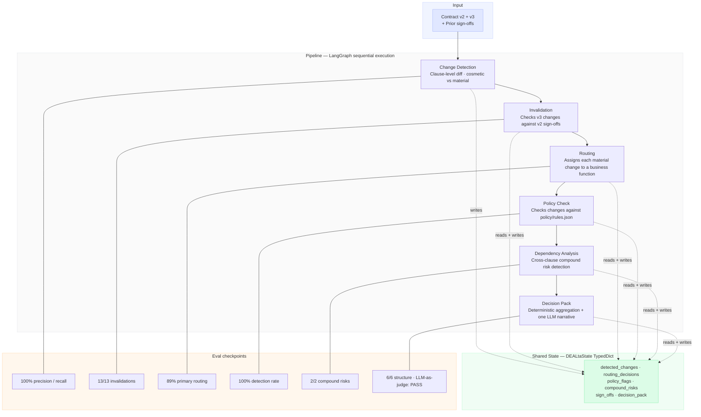

# DEALta

**DEALta is a stateful multi-agent workflow orchestrator for contract review.** It detects changes between document versions, routes each change to the right business function, checks against structured policy rules, identifies cross-clause compound risks that single-reviewer workflows miss, and produces escalation-ready decision packs. It does all this while tracking state across negotiation rounds.

Live showcase: [dealta.mandava.in](https://dealta.mandava.in) | GitHub: [github.com/NaveenBuidl/dealta](https://github.com/NaveenBuidl/dealta)

---

## Architecture



Six agents, orchestrated by LangGraph. All agents read from and write to a single typed state object. Nothing passes between agents outside that state. Each agent has one job, its own eval, and a named trace in Langfuse.

---

## The problem

When a contract goes through multiple revision rounds across Legal, Finance, Commercial, Product, and CS, the coordination overhead grows faster than the review work itself.

Nobody has a clean view of what changed, whether the change is material, who needs to look at it, or whether a new edit in v3 quietly breaks an assumption Finance signed off on in v2. Most of that coordination still happens in email threads and shared documents. The contract owner ends up chasing reviews, reconstructing history, and trying not to miss compound risks that only appear when changes are read together across clauses.

DEALta is built for that gap: the space between "a new draft arrived" and "the right people have reviewed the right changes."

---

## What it does

Give DEALta two contract versions. It returns:

- every clause that changed, classified as cosmetic or material, with materiality level (low / medium / high / critical)
- the internal function that owns review of each material change, with routing reasoning
- policy violations and near-misses, traced to specific rules in `policy/rules.json`
- cross-clause compound risks — risks that no single-clause review would catch
- an escalation-ready decision pack with overall recommendation (ESCALATE / NEGOTIATE / APPROVE\_WITH\_CONDITIONS), required sign-off matrix, and a 2-3 sentence narrative

It also tracks state across rounds. When v3 arrives, the system does not start from zero. It knows what was approved in v2, what conditions those approvals were based on, and which v3 changes break those conditions. Sign-offs that no longer hold are invalidated and re-entered into the review queue.

It does not approve contracts. The output is a triage and routing layer. A human still makes every decision.

---

## Why this is split into agents

Each agent has a narrow, evaluable job.

| Agent | Responsibility |
|---|---|
| Change Detection | Compares two versions clause by clause. Classifies each change as cosmetic or material. Separates rewording from real shifts in obligation or risk. |
| Invalidation | Checks whether any v3 changes break the conditions behind v2 sign-offs — directly (same clause changed) or indirectly (different clause changed but assumed by the prior approval). |
| Routing | Assigns each material change to a primary business function and optionally a secondary. Reasons from change content, not keywords. |
| Policy Check | Tests each material change against `policy/rules.json`. Flags violations and near-misses. Produces traceable rule attributions. |
| Dependency Analysis | Identifies compound risks — risks that emerge only from combinations of two or more changes. The differentiating agent: no single-reviewer workflow catches these. |
| Decision Pack | Aggregates findings from all upstream agents into a structured decision pack. Recommendation logic is deterministic Python. One LLM call produces the narrative summary paragraph. |

The separation is for traceability and independent evaluability. If a flag is wrong, it's attributable to one agent and one prompt — not buried in a 2,000-token monolith. Routing scores at 89% and change detection at 100% independently. If they were merged, a routing error would be invisible inside a detection error.

---

## Where it came from

This project is grounded in a real workflow problem. While coordinating a supplier agreement negotiation at a B2B travel platform, the hardest part was not the negotiation itself — it was tracking what changed across rounds and catching when one edit quietly affected something another function had already reviewed.

A concrete example: an SLA change in a later round altered an assumption behind the commission structure that Finance had effectively reviewed. The dependency was easy to miss because no tooling surfaced cross-clause interactions. DEALta is built to catch that failure mode systematically.

---

## State schema

The shared state is what makes this more than a document summariser. `DEALtaState` tracks:

```python
detected_changes       # what changed and how material it is
routing_decisions      # who needs to review what, with reasoning
policy_flags           # what violates internal rules, with rule attribution
compound_risks         # cross-clause risk pairs and combinations
sign_offs              # accumulated approvals with conditions
issue_register         # open issues across negotiation rounds
escalation_items       # what requires a human decision before proceeding
agent_traces           # full audit trail — which agent did what and when
pipeline_metrics       # per-agent token count, latency, cost
decision_pack          # assembled recommendation for the commercial owner
```

State is version-aware from day one. `SignOff.invalidated` is the key field: it flags prior approvals voided by later changes, so each new draft carries forward the full review history rather than starting from zero.

---

## Eval methodology

Ground truth is written when test data is created, not after agents are built. Each agent is scored independently before being wired into the full pipeline. Evals are the behavioural specification — given the ground truth JSON and eval scripts, the system could be rebuilt from spec alone.

Two eval methods are used because they measure different failure modes:

**Deterministic evals** check structured outputs: clause numbers, severity levels, routing assignments, boolean flags. Python script compares agent output to ground truth JSON. Binary correct/incorrect. Used for every agent except narrative generation.

**LLM-as-judge** checks generated text. The `summary_narrative` in the Decision Pack is free text — there is no exact string to match. A second model (OpenAI `gpt-4o-mini`) reads the narrative alongside structured findings and judges faithfulness. Different provider from the generator (Gemini 2.5 Flash) to avoid correlated blind spots.

### Eval scores — nexus\_staylink\_001 · v2 to v3

| Eval | Primitive tested | Method | Score |
|---|---|---|---|
| Change Detection | Information — is context extraction correct? | Deterministic — precision / recall vs ground truth | 100% / 100% / 100% |
| Invalidation | State — does version-aware tracking work? | Deterministic — 13 checks including true negatives | 13 / 13 |
| Routing | Control — is routing logic correct? | Deterministic — exact match vs ground truth | 89% (known issue, documented) |
| Policy Check | Quality — does the system enforce rules correctly? | Deterministic — clause + rule\_id match | 100% |
| Compound Risk | Intelligence — can the model reason across inputs? | Deterministic — planted risk match | 2 / 2 |
| Decision Pack | Goal — does the output serve the user? | Deterministic — field-level match vs ground truth | 6 / 6 |
| Decision Pack narrative | Quality — is generation faithful to findings? | LLM-as-judge (gpt-4o-mini judges Gemini output) | PASS |

**Known issue — routing at 89%:** The root cause is in change detection, not routing. The change detection agent occasionally merges two legally distinct changes from the same clause (C12 governing law, C13 jurisdiction) into a single entry, so routing receives one item where ground truth expects two. The routing logic itself routes correctly whatever it receives. This is documented in `evals/README.md` and explainable without defending a model failure.

---

## Observability

All six agents are traced in Langfuse. Each run produces a pipeline-level trace with per-agent spans showing wall time, token counts, and estimated cost. Traces are queryable for cost anomalies and latency outliers across runs.

The production eval model follows three layers: deterministic evals gate every deployment as regression tests; LLM-as-judge runs on sampled production outputs to catch reasoning quality drift; Langfuse traces feed back into the eval set when production outputs fail human review, expanding ground truth coverage beyond the synthetic pair the system was built on.

---

## Key decisions

Five architecture tradeoff calls documented with alternatives considered, reasoning, and what would change at scale:

[DECISIONS.md](./DECISIONS.md)

---

## Production thinking

**Inference economics:** $0.0017/run, 58 seconds end-to-end, 6 Langfuse-traced spans. At 100 contracts per day that is approximately $5/month in inference costs. Change detection is the most expensive agent (full clause text from both versions in context). All other agents operate on the extracted change set and cost less than $0.0004 each.

**What changes for real contracts:** Agent logic does not change. What changes is everything upstream of it. Production contracts arrive as PDFs with variable formatting, nested sub-clauses, and cross-references. Clause segmentation becomes the first failure point — downstream agents assume stable clause boundaries, and if segmentation is unreliable, that instability propagates through the full pipeline.

**State persistence:** Current state is in-memory and dies with the process. Production requires a persistent store (PostgreSQL) for audit trails and multi-session negotiation tracking. The state schema — `DEALtaState` as a TypedDict — was designed to serialise cleanly. The migration path is a storage swap, not a schema change.

**What would break first on a second contract type:** Four failure modes in order of likelihood. (1) Policy rules calibrated to travel supplier terms (commission structures, volume triggers) do not map to software licensing risk clusters (IP assignment, source code escrow). (2) Compound risk ground truth assumes clause dependency patterns specific to this contract type. (3) Materiality thresholds reflect one company's commercial risk tolerance, not a universal standard. (4) The eval keying system (clause number as stable identifier) breaks on contracts without numbered clauses. The architecture generalises. The domain knowledge embedded in policy config and ground truth does not. Porting DEALta to a new contract type is a configuration and eval problem, not an architecture problem.

---

## Generalisation

The orchestration pattern — detect a delta, route it to domain reviewers, check it against policy, find cross-domain risks, produce a decision pack — is not specific to contracts. The same pipeline applies to code review (PR diff routed to security / performance / architecture reviewers, checked against dependency and style policies, compound risks like a DB migration coupled to an API change flagged automatically). It applies to PRD review (spec change routed to eng / design / legal, checked for consistency with existing commitments, conflicts between new requirements and in-flight work surfaced). Vendor evaluation, compliance monitoring, incident response triage — any domain where a structured change needs multi-perspective review against accumulated context fits the pattern. The agents change names, the policy rules change content, the ground truth changes shape. The orchestration skeleton transfers intact.

---

## Running locally

```bash
git clone https://github.com/NaveenBuidl/dealta
cd dealta

python -m venv venv
venv\Scripts\activate          # Windows
# source venv/bin/activate    # macOS / Linux

pip install -r requirements.txt

cp .env.example .env
# add GEMINI_API_KEY, OPENAI_API_KEY, LANGFUSE_PUBLIC_KEY, LANGFUSE_SECRET_KEY to .env

# Check which Gemini models have quota before running
python test_quota.py

# Full pipeline — v2 to v3 with prior sign-offs (stateful run)
python run.py \
  --prev-contract contracts/nexus_staylink/v1_v2/nexus_staylink_v2.txt \
  --curr-contract contracts/nexus_staylink/v2_v3/nexus_staylink_v3.txt \
  --prev-version v2 --curr-version v3 \
  --prev-output outputs/pipeline_output_v2_with_3_signoffs.json

# Run individual evals
python evals/eval_change_detection.py
python evals/eval_routing.py
python evals/eval_policy_check.py
python evals/eval_dependency.py outputs/pipeline_output_nexus_staylink_001_v3.json
python evals/eval_stateful.py outputs/pipeline_output_nexus_staylink_001_v3.json
python evals/eval_decision_pack.py outputs/pipeline_output_nexus_staylink_001_v3.json
python evals/eval_llm_judge.py

# Streamlit UI (reads from canonical output JSON)
streamlit run ui/app.py
```

Requires Python 3.11+. Primary model: Gemini 2.5 Flash. Fallback chain: Gemini 2.5 Pro → 2.5 Flash Lite → 2.0 Flash → 2.0 Flash Lite → OpenAI gpt-4o-mini. All model selection is in `config.py` — agent files never hardcode model strings.

---

## Tech stack

| Layer | Choice |
|---|---|
| Orchestration | LangGraph (StateGraph — typed state, explicit edges, named nodes) |
| Primary LLM | Google Gemini 2.5 Flash via `google-genai` SDK |
| Fallback + eval judge | OpenAI gpt-4o-mini |
| State schema | Python TypedDict (top-level state) + Pydantic BaseModel (agent outputs) |
| Output validation | Pydantic with `extra='forbid'` — schema drift fails loudly at agent boundary |
| Tracing | Langfuse — 6 spans per run, per-agent cost and latency |
| UI | Streamlit — demo vehicle only, reading from frozen output JSON |
| Policy config | `policy/rules.json` — structured rules, human-editable, not embedded in prompts |

---

## What this is not

DEALta is not a contract summariser. Summarisation is what you get from one large prompt — no routing, no policy checking, no compound risk detection, no state across rounds. If it only summarises, it has not solved the coordination problem.

It is not a CLM tool. CLM systems handle authoring, approval workflows, and document storage. DEALta sits between "a new draft arrived" and "the right people have reviewed the right changes." It is the triage and routing layer that CLM systems do not provide.

It is not an approval system. Every escalation item requires a human decision. The system surfaces what needs a decision and keeps the review state coherent. Sign-off is always human.

---

## Build log

Session-by-session progress, decisions made, what broke and why: coming soon.
