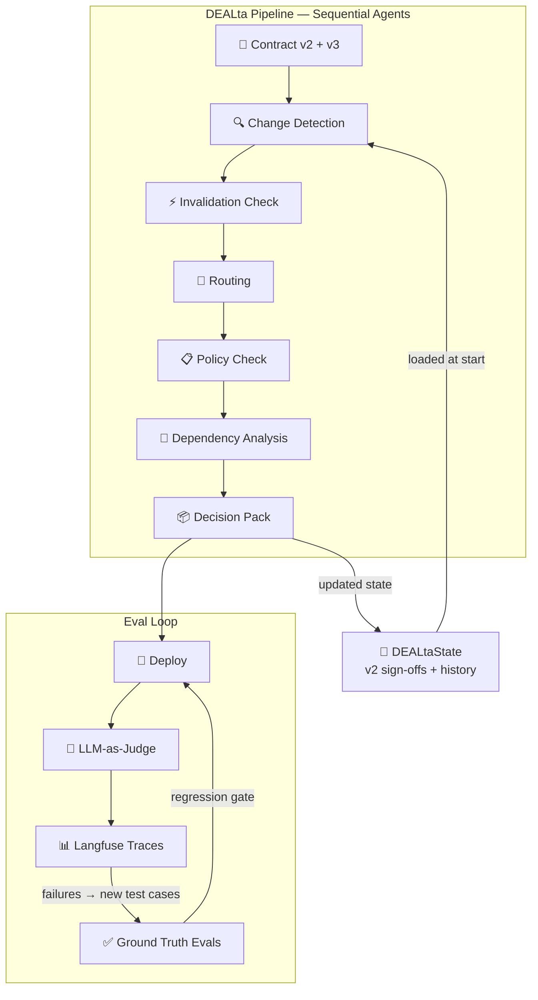

## Production Deployment Thinking

DEALta runs a full contract review — six agents, five LLM calls — for $0.0024. At 100 contracts per day, that's $7.20 per month in inference costs. The economics are already production-viable; the engineering gaps are elsewhere.

### Inference Economics

The pipeline processes 15,006 input tokens and 4,105 output tokens across five LLM calls in ~115 seconds wall time. Change detection is the most expensive agent at $0.00097 per run (41% of total cost) because it needs the full clause set from both contract versions in context. The remaining agents — routing, policy check, dependency analysis, decision pack — operate on the already-extracted change set and cost $0.00034 or less each. Invalidation runs as pure Python when no sign-offs exist in state, costing nothing.

In production, this cost profile suggests a multi-model routing strategy: change detection benefits from a more capable model (it's doing the hardest reasoning — clause-level semantic comparison), while simpler agents like routing and decision pack aggregation can run on Flash-tier models without quality loss. The decision pack agent already demonstrates this principle — its recommendation logic is deterministic Python, with a single LLM call only for the narrative summary paragraph.

### What Changes for Real Contracts

The agent logic doesn't change. What changes is everything upstream of it. The current pipeline ingests synthetic markdown contracts with clean numbered clauses. Production contracts arrive as PDFs with variable formatting, nested sub-clauses, cross-references, and occasionally multiple languages within a single document. PDF parsing (PyMuPDF or PDFPlumber) and clause segmentation become the first failure point — not because parsing is hard in isolation, but because downstream agents assume stable clause boundaries. If clause segmentation is unreliable, change detection produces unstable outputs, and every agent downstream inherits that instability. This is the same class of problem as the identifier stability issue that surfaced during eval design: the system needs stable anchors, and production contracts don't guarantee them.

### Eval-in-Production Loop

DEALta's eval methodology was built as a sequential discipline — ground truth defined before agents, scored after every change. In production, this becomes a continuous loop with three layers. First, the existing deterministic eval suite (100% change detection, 100% policy, 6/6 decision pack) runs as regression tests before every deployment, gating releases on known-good outputs. Second, LLM-as-judge evaluation runs on a sample of production outputs, catching reasoning quality degradation that deterministic checks miss — the kind of subtle drift where an agent starts generating plausible but wrong justifications. Third, Langfuse traces feed back into the eval set: when a production output fails human review, that contract pair becomes a new test case with its own ground truth, expanding coverage beyond the single synthetic pair the system was built on. Eval isn't a phase that ends at deployment. It's the mechanism that makes deployment safe to repeat.

### State Persistence

Current state lives in memory and dies with the process. This is a known gap, not an oversight — the architecture was designed for in-memory state because the build priority was proving orchestration logic, not building infrastructure. Production requires PostgreSQL or a similar persistent store for two reasons: audit trails (who reviewed what, when sign-offs were given, which changes triggered invalidation) and multi-session negotiation tracking (a v3 review that spans days needs to resume where it left off, with v2 sign-off history intact). The state schema — `DEALtaState` as a TypedDict with version-aware cumulative logs — was designed to serialize cleanly. The migration path is straightforward; the schema doesn't change, only where it lives.

### KV-Cache Opportunity

Each agent call shares a stable prefix: system prompt, state schema definition, and output format instructions. These prefixes don't change between runs or between contract pairs. A production deployment behind an inference provider that supports KV-cache (or prompt caching) would see significant cache hit rates on these prefixes, reducing per-run cost below the current $0.0024 baseline. The agents with the longest system prompts — change detection and policy check — would benefit most, which conveniently maps to the two most expensive agents in the current profile.

### A2A Protocol

Google's Agent-to-Agent protocol is a future consideration for enterprise integration, where DEALta's agents would need to coordinate with external systems like CLM platforms or approval workflows.

### What Would Break First

Four failure modes, in order of likelihood. First, PDF parsing on non-standard clause formats — contracts without numbered clauses, or with deeply nested sub-sections, break the assumption that clause boundaries are detectable. This is the highest-risk gap because it's upstream of everything. Second, materiality calibration per contract type — what's material in a travel supplier agreement (commission clawback, volume thresholds) isn't material in a software license (IP assignment, indemnification scope). The current policy rules are calibrated for one contract type. Scaling to others requires per-type policy configuration, not just more rules. Third, the state persistence gap described above — any negotiation spanning multiple sessions will lose context. Fourth, eval set coverage — ground truth covers one synthetic contract pair. Production confidence requires eval coverage across contract types, clause structures, and edge cases that only surface in the wild. The eval loop described above is the mechanism for closing this gap, but it starts narrow.

*Langfuse tracing is integrated. Known instrumentation gaps — input/output prompt text not captured in spans, token counts not displaying in the Langfuse UI, trace named `decision_pack` rather than `dealta-pipeline-run` — are documented but not fixed. The trace confirms all six agents execute in sequence with correct timing.*
